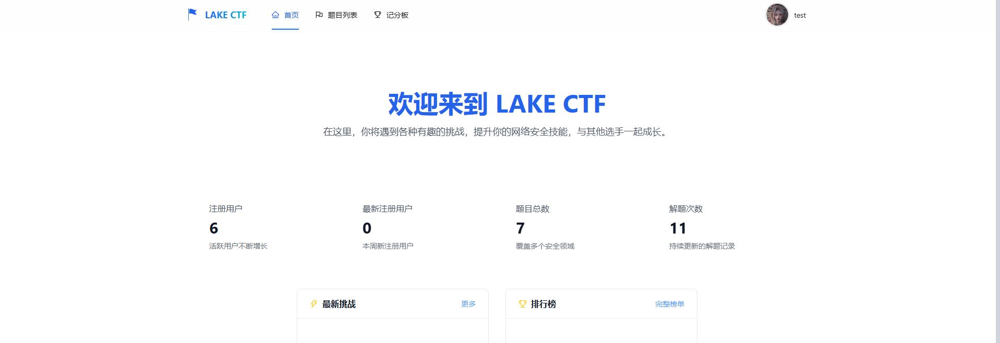
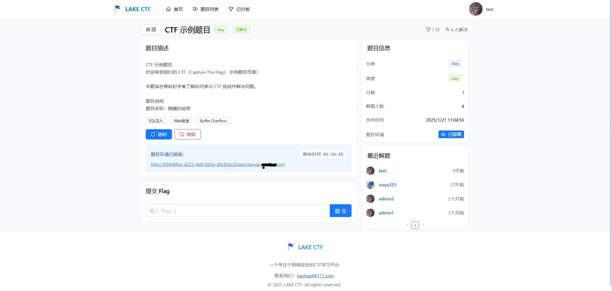
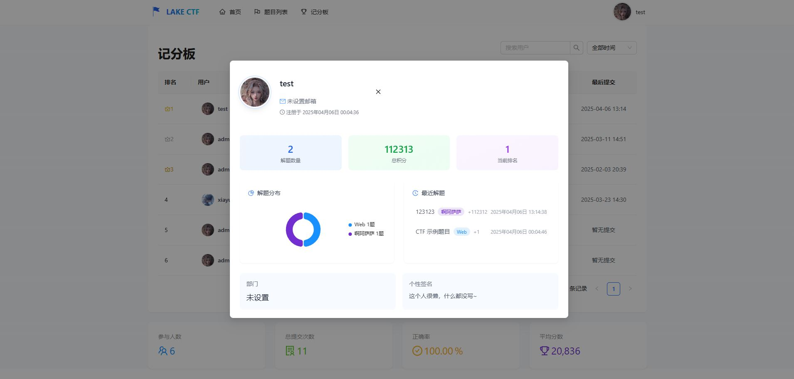
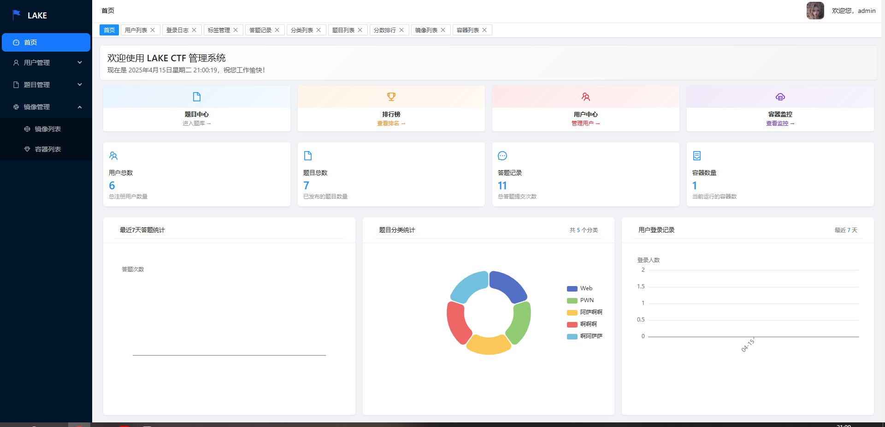

#  Lake CTF Platform Deployment Guide

> 🏴‍☠️ 部署属于你自己的 CTF 平台  
> 让你的团队快速搭建训练环境平台！

---

## 📦 环境要求

- ✅ Docker = 28.0.1
- ✅ 推荐系统：Ubuntu 22.04+ 
- ✅ Mysql：8.0+
- ✅ Nginx
- ✅ https

---

### 🖥️ 前台：







### 🌐后台：



## ⚙️ 配置说明

在linux中创建var/www/lake文件夹，把lake上传到此文件夹中。(**var/www/lake**)。关于第一次运行程序，赋予lake权限(**chmod 777 lake**)，运行lake会在本地生成front（前台）、manager（后台）、config（配置文件）、avatar（头像存储）。关于docker镜像源地址无法访问需要自行解决。后台登录账号：admin，密码：123456

## 🚀docker安装

```bash
curl -fsSL https://mirrors.aliyun.com/docker-ce/linux/ubuntu/gpg | sudo gpg --dearmor -o /usr/share/keyrings/docker-archive-keyring.gpg

echo \
"deb [arch=amd64 signed-by=/usr/share/keyrings/docker-archive-keyring.gpg] https://mirrors.aliyun.com/docker-ce/linux/ubuntu \
$(lsb_release -cs) stable" | sudo tee /etc/apt/sources.list.d/docker.list > /dev/null

sudo apt update

sudo apt install -y docker-ce docker-ce-cli containerd.io
```

🚀Nginx配置

```
user www-data;
worker_processes auto;
pid /run/nginx.pid;
error_log /var/log/nginx/error.log;
include /etc/nginx/modules-enabled/*.conf;

events {
	worker_connections 768;
	# multi_accept on;
}

http {
	sendfile on;
	tcp_nopush on;
	types_hash_max_size 2048;
	include /etc/nginx/mime.types;
	default_type application/octet-stream;
	ssl_protocols TLSv1 TLSv1.1 TLSv1.2 TLSv1.3; # Dropping SSLv3, ref: POODLE
	ssl_prefer_server_ciphers on;
	access_log /var/log/nginx/access.log;
	gzip on;

	include /etc/nginx/conf.d/*.conf;
	include /etc/nginx/sites-enabled/*;

	 server {
        listen 80;
        server_name xxxx.com;  # 你的域名
        return 301 https://$host$request_uri;  # 强制HTTP重定向到HTTPS
    }
    
    server {
        listen 443 ssl;  # 启用SSL
        server_name xxxx.com;  # 你的域名

        # 禁止 HEAD 请求（常用于爬虫探测）
	    if ($request_method ~* ^HEAD$) {
	        return 403;
	    }

        # 屏蔽某些常见爬虫的 User-Agent
        if ($http_user_agent ~* (python|scrapy|curl|wget|bot|spider|Go-http-client|python-requests|nmap|Masscan|PhantomJS)) {
            return 403;
        }
        
        # SSL证书及密钥
        ssl_certificate /etc/nginx/cert/xxxx.com.pem;  # 替换为你的SSL证书路径
        ssl_certificate_key /etc/nginx/cert/xxxx.com.key;  # 替换为你的私钥路径

        # 网站根目录，指向前端文件
        root /var/www/lake/front/dist;
        index index.html index.htm;
        # 配置静态文件路径
        location /avatar/ {
            root /var/www/lake;  # 确保路径与Go应用的路径相匹配
        }

        # 处理静态文件（前端 SPA）
        location / {
             try_files $uri $uri/ /index.html;
       }

        # API反向代理到后端服务
        location /api/v1 {
            proxy_pass http://127.0.0.1:3000;  # 反向代理到后端API服务
            proxy_set_header Host $host;
            proxy_set_header X-Real-IP $remote_addr;
            proxy_set_header X-Forwarded-For $proxy_add_x_forwarded_for;
            proxy_set_header X-Forwarded-Proto $scheme;
        }
    }


server {
        listen 443 ssl;  # 启用SSL
        server_name manager.xxxx.com;  # 你的域名
        
        # SSL证书及密钥
        ssl_certificate /etc/nginx/cert/manager.xxxx.com.pem;  # 替换为你的SSL证书路径
        ssl_certificate_key /etc/nginx/cert/manager.xxxx.com.key;  # 替换为你的私钥路径

        # 网站根目录，指向前端文件
        root /var/www/lake/manager/dist;
        index index.html index.htm;
        # 配置静态文件路径
        location /avatar/ {
            root /var/www/lake;  # 确保路径与Go应用的路径相匹配
        }

        # 处理静态文件（前端 SPA）
        location / {
             try_files $uri $uri/ /index.html;
       }

        # API反向代理到后端服务
        location /api/v1 {
            proxy_pass http://127.0.0.1:3000;  # 反向代理到后端API服务
            proxy_set_header Host $host;
            proxy_set_header X-Real-IP $remote_addr;
            proxy_set_header X-Forwarded-For $proxy_add_x_forwarded_for;
            proxy_set_header X-Forwarded-Proto $scheme;
        }
    }


server {
    listen 80;
    server_name *.change.xxxx.com;  # 你的域名
    location / {
        proxy_pass http://127.0.0.1:3001;  # 反向代理到后端API服务
        proxy_set_header Host $host;
        proxy_set_header X-Real-IP $remote_addr;
        proxy_set_header X-Forwarded-For $proxy_add_x_forwarded_for;
        proxy_set_header X-Forwarded-Proto $scheme;
    }
}    
}
```

